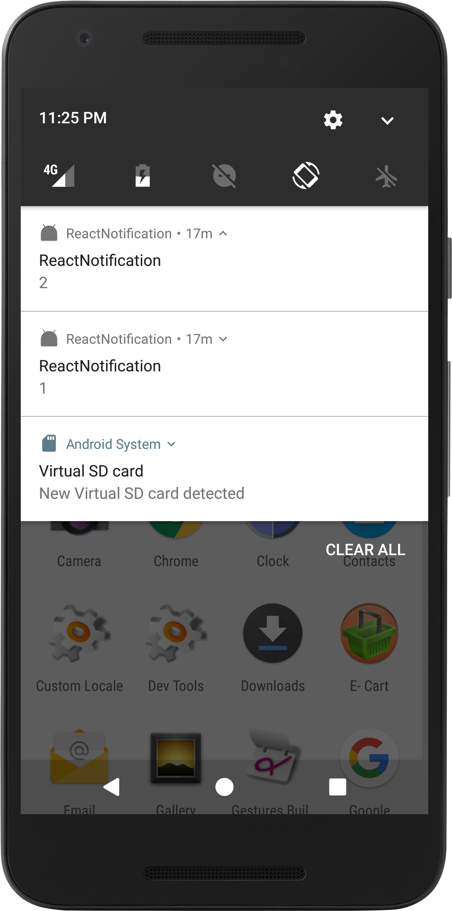

# ReactNotification

How to integrate FCM (firebase cloud messaging) with react-native

## This Projects Features

- How to integrate Google [Firebase Cloud Messagingn](https://firebase.google.com/docs/cloud-messaging/android/client) in an React Native App.
- Recieve and Send Messages using FCM.

 

### Legal

     Copyright 2017 Hitesh Sahu (http://hiteshsahu.com)

       Licensed under the Apache License, Version 2.0 (the "License");
       you may not use this file except in compliance with the License.
       You may obtain a copy of the License at

           http://www.apache.org/licenses/LICENSE-2.0

       Unless required by applicable law or agreed to in writing, software
       distributed under the License is distributed on an "AS IS" BASIS,
       WITHOUT WARRANTIES OR CONDITIONS OF ANY KIND, either express or implied.
       See the License for the specific language governing permissions and
       limitations under the License.

